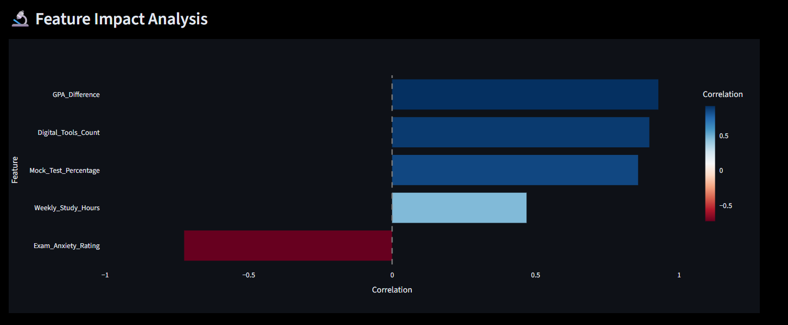
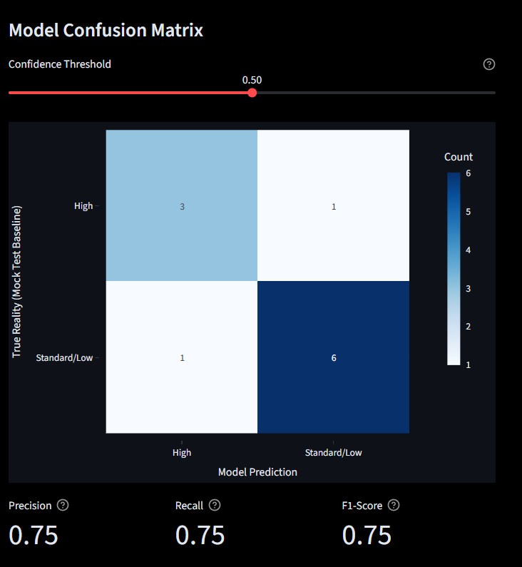
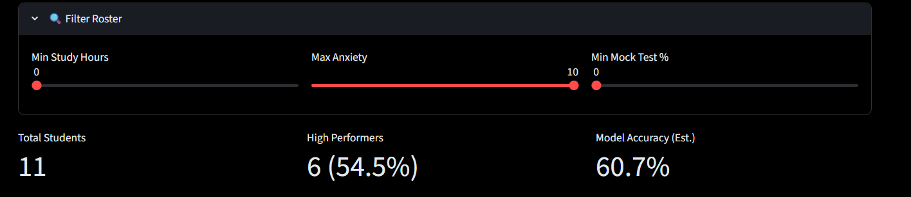

# 🎓 Student Performace Burnout Dashboard


An explainable AI-powered analytics platform for identifying burnout risk, exploring student behavior patterns, and supporting intervention decisions through interactive machine learning insights.

The system combines predictive modeling, explainability, threshold calibration, cohort analytics, and role-based operational dashboards within a decoupled microservices architecture.

🌐 **Live Demo:** [Add Hugging Face Space Link]

---

## Highlights

- 🤖 LightGBM Burnout Prediction
- 🔍 SHAP Explainability
- 📊 Interactive Research Analytics
- 🎚️ Dynamic Threshold Calibration
- ⚡ FastAPI + Streamlit Architecture
- 🔄 Async API Communication
- 🧠 LLM-Assisted Student Insights

---

# Problem Statement

Student burnout is a growing challenge in educational environments, often driven by a combination of academic pressure, anxiety, study imbalance, and learning inefficiencies. Traditional approaches frequently identify struggling students only after performance begins to decline.

This project addresses that challenge by combining machine learning, explainable AI, and interactive analytics into a unified decision-support platform that helps:

* Identify students at risk of burnout
* Understand the factors driving burnout predictions
* Analyze cohort-level behavioral trends
* Explore intervention strategies through simulation
* Support data-driven decision making

---

# Dashboard Preview

## Overview Dashboard


*Main operational dashboard displaying cohort statistics, burnout risk distribution, and student analytics.*

---

## Correlation-Based Feature Analysis



*Correlation-based feature analysis showing the relationship between academic and behavioral indicators and burnout outcomes.*

---

## Threshold Calibration & Model Evaluation



*Interactive threshold controller allowing dynamic precision-recall tradeoff analysis with real-time confusion matrix updates.*

---

## Research Analytics


*Correlation analysis, feature distributions, cohort segmentation, and automated research insights.*

---

## Student Filtering & Cohort Exploration



*Interactive filtering tools enabling exploration of student groups across academic and behavioral dimensions.*

---

# Key Features

## Predictive Analytics

* LightGBM-powered burnout risk classification
* Real-time prediction confidence scoring
* Dynamic threshold tuning
* Interactive confusion matrix visualization
* Probability-based risk assessment

## Explainable AI

* SHAP feature importance analysis
* Global model interpretability
* Feature contribution visualization
* Transparent prediction reasoning

## Research & Cohort Analytics

* Correlation matrix exploration
* Performance distribution analysis
* Feature distribution monitoring
* Student cohort segmentation
* Automated insight generation

## Operational Dashboard

* Counselor Portal
* Recruiter Portal
* Role-based access control
* Secure credential management
* Interactive student filtering

---

# Engineering Highlights

## Decoupled Frontend–Backend Architecture

The system follows a microservices-inspired architecture with complete separation between user interface and model inference services.

### Frontend

* Streamlit
* Plotly Visualizations
* Interactive Analytics Components

### Backend

* FastAPI
* Pydantic V2
* LightGBM Inference Engine

### Communication Layer

* REST APIs
* JSON Payload Exchange
* Async HTTP Requests

---

## Asynchronous Processing Pipeline

To improve responsiveness and scalability, the application utilizes:

* `httpx`
* `asyncio`

Batch operations execute concurrently rather than sequentially, reducing frontend-to-backend communication overhead.

---

## Production-Oriented Model Serving

The FastAPI backend leverages lifespan management to:

* Load the trained LightGBM model only once
* Reduce repeated disk I/O operations
* Improve inference efficiency
* Optimize memory utilization

---

## Robust Analytics Infrastructure

Visualization components were engineered to remain stable under aggressive filtering conditions using:

* Controlled categorical indexing
* Missing category preservation
* Dynamic matrix stabilization
* Zero-collapse chart prevention

---

# System Architecture

```text
       ┌────────────────────────┐                   ┌────────────────────────┐
       │   Streamlit Frontend   │                   │  FastAPI LGBM Backend  │
       │ (Hugging Face Space A) │                   │ (Hugging Face Space B) │
       └───────────┬────────────┘                   └───────────▲────────────┘
                   │                                            │
                   │  ───► Async HTTP Requests ───────────────► │
                   │  ◄─── JSON Prediction Responses ◄───────── │
                   │                                            │
       ┌───────────▼────────────┐                               │
       │ Secure Token Validator │───────────────────────────────┘
       │   Environment Secrets  │
       └────────────────────────┘
```

---

# Machine Learning Pipeline

## Input Features

The model evaluates several engineered academic and behavioral indicators:

* Study Balance
* GPA Difference
* Skill Retention Score
* Anxiety Level During Exams
* Tool Diversity

## Model

* LightGBM Classifier
* Probability-based Predictions
* Threshold-adjustable Decision Layer

## Evaluation Metrics

The platform provides interactive monitoring of:

* Precision
* Recall
* F1 Score
* Confusion Matrix
* Threshold Sensitivity

---

# Threshold Calibration

Unlike traditional fixed-threshold classifiers, this platform provides an interactive decision threshold controller.

## High Recall Mode

* Captures more potentially at-risk students
* Minimizes false negatives
* Useful for early intervention strategies

## High Precision Mode

* Reduces unnecessary interventions
* Minimizes false positives
* Useful when resources are limited

## Balanced Mode

* Optimizes overall F1 Score
* Balances intervention coverage and prediction reliability

This allows stakeholders to align model behavior with operational objectives rather than relying on a static classification boundary.

---

# Research Insights Framework

The platform includes a dedicated research section capable of exploring:

* Relationships between academic and behavioral variables
* Burnout risk distributions across cohorts
* Feature interaction patterns
* Correlation structures
* Explainability-driven observations

This transforms the project from a simple prediction system into a decision-support and analytics platform.

---

# API Specifications

## Health Check

```http
GET /proxy/
```

Verifies backend deployment and service availability.

---

## Prediction Endpoint

```http
POST /proxy/predict
```

### Example Response

```json
{
  "prediction_code": 1,
  "prediction": "High",
  "confidence": 0.8421,
  "status": "Success"
}
```

---

## API Documentation

```http
GET /proxy/docs
```

Provides interactive Swagger documentation for endpoint testing.

---

# Technology Stack

## Frontend

* Streamlit
* Plotly

## Backend

* FastAPI
* Uvicorn
* Pydantic V2

## Machine Learning

* LightGBM
* SHAP
* Pandas
* NumPy

## Infrastructure

* Hugging Face Spaces
* Asyncio
* HTTPX

---

# Installation

## Clone Repository

```bash
git clone https://github.com/your-username/student-burnout-intelligence-suite.git

cd student-burnout-intelligence-suite
```

## Install Dependencies

```bash
pip install -r requirements.txt
```

## Configure Credentials

```bash
export COUNSELOR_PASSWORD="your_password"

export RECRUITER_PASSWORD="your_password"
```

## Start Backend

```bash
uvicorn backend.main:app --reload
```

## Start Frontend

```bash
streamlit run app.py
```

---

# Repository Structure

```text
student-burnout-intelligence-suite/
│
├── backend/
│   ├── main.py
│   ├── models/
│   └── routes/
│
├── frontend/
│   ├── app.py
│   └── pages/
│
├── screenshots/
│   ├── dashboard_overview.png
│   ├── shap_analysis.png
│   ├── threshold_analysis.png
│   ├── research_analytics.png
│   └── student_filtering.png
│
├── requirements.txt
├── README.md
└── LICENSE
```

---

# Future Enhancements

* Counterfactual intervention recommendations
* Burnout trend forecasting
* Longitudinal student tracking
* Advanced explainability dashboards
* LLM-assisted counseling support
* Multi-institution benchmarking

---

# Project Outcome

This project demonstrates the integration of machine learning, explainable AI, asynchronous system design, API engineering, and interactive analytics into a unified decision-support platform for student burnout analysis and intervention planning.
